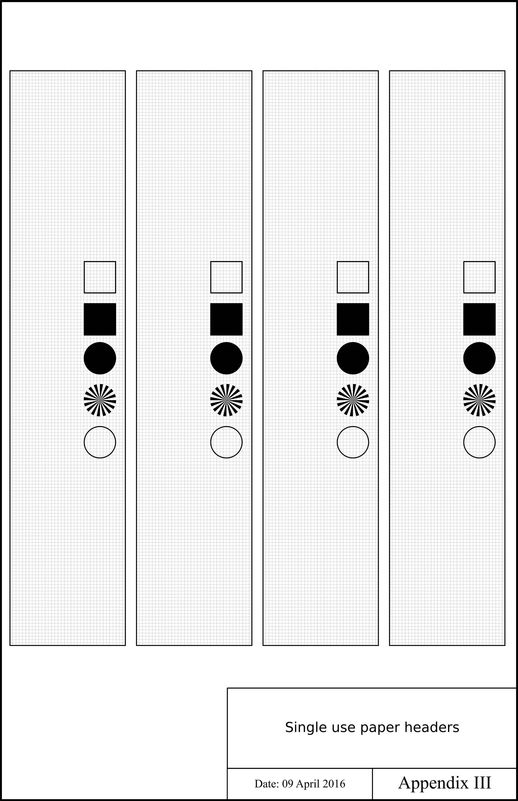

Zakład Geomorfologii i Geologii Czwartorzędu — PROCEDURA

------------------------------------------------------------------------

# Skanowanie hiperspektralne

## Przygotowanie rdzeni

Wskazane jest skanowanie świeżych rdzeni, możliwie szybko po otwarciu ze
względu na postępującą z czasem degradację pigmentów. Rdzenie muszą
zostać oczyszczone i w miarę możliwości wyrównane. Należy usunąć
wierzchnią warstwę osadu, starając się nie powodować powstawania linii
po wyrównywaniu. Jest to szczególnie istotne w przypadku drobnej
laminacji. W przypadku osadów przechowywanych przez dłuższy czas, należy
zwrócić uwagę na usunięcie oznak utlenienia, wtórnej krystalizacji,
biofilmów i tym podobnych.

Woda i wilgoć na powierzchni rdzeni, oraz świeże, ciemne osady znacząco
utrudniają analizę spektralną. Po oczyszczeniu rdzenie należy
zabezpieczyć i pozostawić w ciemnym pomieszczeniu do czasu wyschnięcia
powierzchni. Rdzenie można pozostawić w otwartych D-tubach. Na czas
schnięcia rdzenie przechowywać w ciemnym miejscu w celu uniknięcia
fotodegradacji pigmentów. Rdzeni nie należy pozostawiać do wyschnięcia
na długo, ponieważ zaczną pękać. Drobnoziarniste osady mineralne zaczną
pękać prędzej od biogenicznej gytii. W przypadku nowego materiału
rdzenie należy obserwować w celu oceny optymalnego okresu wysychania.
Przeważnie materiał można przygotować po południu i sprawdzić na drugi
dzień rano.

Jeśli rdzeń jest wyrównany, ale jedna ze stron się zapada, można
zastosować podkładkę w celu wyrównania poziomu rodzenia.

## Przygotowanie do pracy

### Wybór ustawień

- Wąskie rdzenie (**Φ 63 mm**): obiektyw **50.0 mm**; razem z aluminiową
  szyną.

- Szerokie rdzenie (**Φ 90 mm**): obiektyw **18.5 mm**; bez aluminiowej
  szyny.

### Przygotowanie stanowiska

- Włączyć zasilacz awaryjny UPS pod stołem.

- Włączyć komputer (przełączniki od dołu do góry).

- Włączyć iluminator (przełącznik z przodu urządzenia).

- Upewnić się, że włączony jest tryb **VNIR** (przełącznik z przodu
  urządzenia).

- Ostrożnie usunąć osłonę obiektywu.

  Upewnić się, że wybrany jest właściwy obiektyw.

- Ułożyć rdzeń na prowadnicy, stropem do góry.

- Ustawić stolik ze wzorcem bieli oraz **focus grid** na równi z
  powierzchnią rdzenia.

- Ustawić miarkę na równi z rdzeniem, możliwie równolegle.

  W miarę konieczności ułożyć miarę na rdzeniu, **równoległe** ułożenie
  miary jest **priorytetem**. Lepszy wynik osiągnie się przy minimalnie
  różnym poziomie między miarą a osadem, ale przy zachowaniu
  równoległego ułożenia. Wzrost **kąta** między osią miary i rdzenia
  skutkuje **zniekształceniem** na etapie przetwarzania danych.
  Określenie właściwej pozycji **stropu** i **spągu** na mierze jest
  czynnikiem **krytycznym**.

- Ostrożnie umieścić wzorzec bieli na stoliku (sztabka
  BaSO4); łapać tylko za boki i delikatnie usunąć kurz (na
  przykład chusteczkami do obiektywów).

- Jeśli poziom rdzeni jest do siebie **mocno** zbliżony, **nie należy**
  **korygować** ustawień kamery.

- Na stoliku, na części zajętej przez biały plastikowy blok umieścić
  papierową etykietę z symbolem rdzenia.

## Oprogramowanie Lumo Scanner

### Zakładka Setup

- Pole `Camera`, wybrać odpowiednią kamerę – `Connect`.

  W tej chwili jedyna dostępne urządzenie to kamera **VNIR**.

- Pole `calibration pack` wybrać odpowiedni plik kalibracyjny, zależny
  od obiektywu.

  - Obiektyw **18.5 mm**

    *Specim\Documents\Calibration\560025_20211124_OLE18.5_calpack.scp*

  - Obiektyw **50.0 mm**

    *Specim\Documents\Calibration\560025_20211124_OL50_calpack.scp*

- Zmiana obiektywu wymaga ponownego uruchomienia programu i połączenia z
  kamerą.

- Pole `Capture folder`: wybrać folder, w którym będą zapisywane dane.

- Pole `Dataset prefix`: wspólny przedrostek (*prefix*) zbioru danych
  (np. **GOR-20**).

- Pole `Motor 1`: połączyć program z napędem skanera – `Connect`.

### Zakładka Adjust

- Panel `Spectral Camera sCMOS` pole `Spectral binning`: **2**.

  W przypadku skanowania tylko w celu wykonania dokumentacji
  fotograficznej można zmienić wartość na wyższą.

- Panel `Spectral Camera sCMOS` pole `Spatial binning`: **1**.

  Ta wartość ma charakter stały, nie należy jej zmieniać.

- Ustawić kamerę na takiej wysokości, aby objęła cały rdzeń razem z
  miarą oraz niewielkim zapasem (**około 1 cm**) z obu stron. Rdzeń
  można przesuwać do przodu i do tyłu odpowiednimi przyciskami w polu
  `Motor`. Przy podglądzie należy upewnić się, że widać całość
  rejestrowanego przez kamerę obrazu.

- Po wybraniu odpowiedniej wysokości należy ustawić skaner na obszar
  **focus grid** w polu `Sensor 1` position – `Go`.

  #### Ekspozycja

- W panelu `Spectral Camera sCMOS` ustawić opcje ekspozycji.

  Celem jest zmaksymalizowanie jasności bez osiągnięcia nadmiernej
  ekspozycji (*overexposure*) widocznej jako czerwone piksele na
  podglądzie.

- W panelu `Detector` (lewy górny wykres) przesunąć białą linię nad
  środek białego pola **focus grid** możliwie blisko środka pola
  `focus grid` (centralnie pod obiektywem).

  Wartości rejestrowane na linii widoczne są w panelu `Wavelenght`
  (dolny lewy wykres). Celem jest osiągnięcie maksymalnej wartości dla
  białej krzywej bez przekroczenia maksymalnych wartości na osi Y
  (pozostawić pewien zapas). Zwiększenie jasności polega na zwiększeniu
  wartości czasu ekspozycji (*exposure time*, ET). ET zmienia się
  odwrotnie do częstotliwości wyświetlania klatek (*frame rate*, FR).

- Metodą prób i błędów ustawić FR (frame rate), zastosować wartość –
  `Apply`, ustawić maksymalną możliwą ekspozycję, zastosować wartość –
  `Apply`. Sprawdzić wykres w panelu `Wavelenght` (lewy dolny wykres), w
  miarę konieczności skorygować, za każdym razem ustawiając wartość –
  `Apply`.

  Każda zmiana wysokości stolika lub kamery (dystansu optycznego) wymaga
  korekty jasności i zastosowania nowych wartości.

  #### Ostrość

- Po uzyskaniu właściwej jasności należy dokonać korekty ostrości w
  oparciu o wykresy: `Waterfall` (prawy górny wykres) oraz `Pixels`
  (prawy dolny wykres). Pomoc stanowi również prawy panel `Focusing`.

- Należy obracać obiektywem tak aby osiągnąć możliwe wyraźne białe i
  czarne pasy na wykresie `Waterfall` oraz możliwie ostre, spłaszczone
  piki na wykresie `Pixels`.

  Wykres `Waterfall` można przybliżyć i oddalić menu prawego przycisku
  myszy, po odznaczeniu opcji `fit to window`. Ostre krawędzie na
  wykresie `Pixels` oznaczają wysoki kontrast między czarnymi i białymi
  pasami pola **focus grid**. Kolor paska w panelu `Focusing` należy
  traktować jako wskazówkę. Metodą prób i błędów, przez przekroczenie
  ostrości w obu kierunkach zawęzić pole wyostrzania w celu osiągnięcia
  możliwie ostrego obrazu. Dobry obraz jest wyraźny na wykresie
  `Waterfall`, „kanciasty” na wykresie `Pixels` a panel `Focusing`
  pokazuje pomarańczowy lub zielony pasek.

  #### Prędkość skanowania

- Prędkość skanowania należy ocenić na podstawie pola widzenia kamery
  (*field of view*, FOV).

- Najpierw w zakładce **Adjust** przesunąć zdecydowanie rdzeń
  przyciskami w panelu `Motor`, aby oszacować zakres pola widzenia.

- Przejść do zakładki **Capture**.

- Upewnić się, że widoczny jest cały obraz z kamery.

  Wykres można przybliżyć i oddalić menu prawego przycisku myszy, po
  odznaczeniu opcji `fit to window`.

- W panelu `Motor` przesuwać rdzeń do przodu, tak aby pojawiła się
  poprzeczna miara poprzedzająca strop.

- Wykonać zrzut ekranu, wkleić na przykład do **MS Paint** i dokładnie
  odczytać wartość na miarce, wyrażoną w mm.

  Należy upewnić się, że wyświetlany obraz to cały obraz rejestrowany
  przez kamerę. Podgląd ma tendencję do przybliżania środka kadru.

- Wrócić do zakładki **Adjust**. W panelu `Scanning speed calculation`
  wybrać opcję **Field of view**. Wprowadzić odczytaną wartość FOV
  wyrażoną w **mm**.

- Alternatywnie można wykonać krótki skan i odczytać wartość z
  wygenerowanego pliku.

  #### Długość skanowania

- Panel `Sensor 1 positions`.

  - Pole `Target start`: **250 mm**. Wartość stała.

  - Pole `Target stop`: **długość rdzenia (mm) + 300 mm** – `Set`.

### Zakładka Capture

- Upewnić się, czy na dysku jest wolne miejsce.

  W dolnej części okna widoczne jest **Free disk space**. Musi mieć
  wartość minimum **10 minut**.

- Sprawdzić `Traffic lights`.

  Wszystko powinno być zielone poza **Trigger mode**, które pokazuje się
  na czerwonym tle jako **internal**. **Sensor temp** (Temperatura
  kamery), może być wyświetlona na pomarańczowym tle, ale nie należy
  zostawiać urządzenia włączonego bezczynnie, tak aby się nie
  przegrzało.

- Uzupełnić dane w panelu `Metadata`:

  - Pole `Dataset name`: kod rdzenia

    Jeśli **Dataset prefix** to **GOR-20**, wtedy **Dataset name** to
    np. **01** dla rdzenia **GOR-20/01**.

  - Jeśli rdzeń wykracza poza miarę, należy zeskanować go dwukrotnie, od
    stropu i od spągu.

    W takim przypadku do **Dataset name** dodać podkreślenie i
    przyrostek (*sufix*) **front** lub **rear** (np. **01_front**). W
    ten sposób skanowanie od strony stropu jest zawsze sortowane
    leksykalnie przed skanowaniem od strony spągu.

  - Właściwy **Dataset name** powinien mieć następującą formę:

    - 01: skanowanie całego rdzenia.

    - 01_front: skanowanie rdzenia od stropu.

    - 01_rear: skanowanie rdzenia od spągu.

- Pole `Operator`: inicjały osoby wykonującej skanowanie.

  Dopuszczalne: MZ, JP, MK.

- Wyłączyć monitor, zgasić światła w pomieszczeniu, zamknąć drzwi i
  wywiesić kartkę informującą o skanowaniu.

- Połączyć się z komputerem korzystając ze zdalnego pulpitu.

- Rozpocząć skanowanie guzikiem `Record`.

## Zakończenie pracy

Jeśli nie została przekroczona pojemność dysku skanowanie powinno
zakończyć się bez błędów.

- Poczekać aż szyna wraz ze rdzeniem wróci na pozycję początkową
  (komunikat *Homing*).

  Nigdy nie przesuwać szyny ręcznie przy włączonym silniku.

- Wyłączyć kamerę i iluminator z przodu urządzenia.

- W zakładce **Setup** użyć przycisków `Disconnect` w polach `Camera`
  oraz `Motor 1`.

- Zamknąć oprogramowanie **Lumo Scanner**.

- Przenieść zgromadzone dane na serwer Zakładu.

  Ze względu na duży rozmiar danych można pozostawić proces na noc.

- Zamknąć system Windows (`Windows` – `Shut down`).

- Po zamknięciu systemu wyłączyć zasilanie w kolejności od góry do dołu.

- Wyłączyć zasilacz awaryjny UPS.

- Schować wzorzec bieli, chwytając tylko za boki.

- Ostrożnie założyć osłonę obiektywu.

- Wyczyścić miejsce pracy.

# Załącznik 1: etykiety

*Źródło*: Butz 2016.

## Rejestr zmian

16.11.2022, MZ – wersja inicjalna.

17.11.2022, MZ – pierwsze poprawki.

30.11.2022, MZ – kolejne poprawki. Pierwsza wersja Quarto.

09.12.2022, MZ – poprawki, dodano info i wzór etykiet.

Maurycy Żarczyński 2022-12-09
